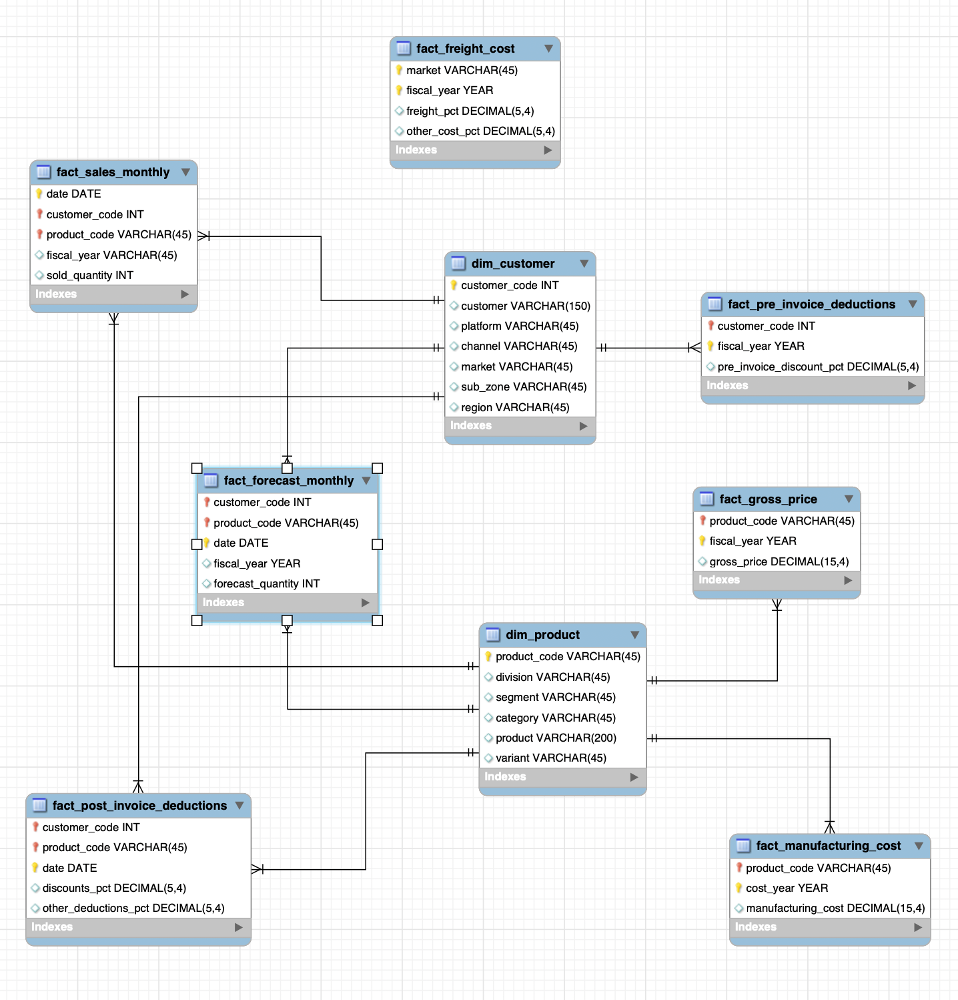

# Sales-and-Market-Analysis-Database-System

### Project Overview
---
This project implements a comprehensive SQL database system designed for large-scale sales and market analysis. It manages extensive sales records with detailed information about products, customers, pricing, and transactions. The system supports complex queries that facilitate data-driven insights into sales performance, customer behavior, and market trends.

### Data Confidentiality
---
The data handled within this project is strictly confidential and proprietary. It must be safeguarded and accessed only by authorized personnel. No confidential information should be shared or exposed outside the intended environment to maintain data privacy and compliance.

### Database Structure
---
The database consists of multiple interrelated tables that store information about products, customers, sales transactions, pricing details, and other relevant entities. The schema is normalized to reduce redundancy and improve query efficiency. Key tables include:

•	Products — product details such as ID, name, category

•	Customers — customer information and demographics

•	Sales — transaction records including product, quantity, price, and date

•	Pricing — price data linked to products and time periods

(For complete details, see the create_database.sql file.)

### ER Diagram
---
An Entity-Relationship (ER) diagram illustrating the database schema and the relationships between tables is included in this project. It provides a visual overview of how data entities are structured and linked.

### Queries Performed
---
The project implements various advanced SQL queries to analyze and extract valuable insights from the dataset. The key types of queries include:

•	Sales Summary Queries: Aggregate sales data to compute total sales, average price, and quantities sold across different time frames and product categories.

•	Customer Analysis Queries: Identify top customers by purchase volume, analyze buying patterns, and segment customers based on sales data.

•	Pricing Trends Queries: Track price changes over time and their impact on sales.

•	Market Performance Queries: Compare product performance, identify high-demand products, and evaluate seasonal trends.

•	Complex SQL Techniques: Utilization of Common Table Expressions (CTEs), window functions, joins, subqueries, and aggregation to optimize data retrieval and analysis.

(Refer to the queries.sql file for the complete set of SQL queries.)

### How to Use
---
	1.	Run the create_database.sql script to set up the database schema and tables.
	2.	Populate the tables with the relevant sales and customer data (confidential).
	3.	Execute queries from Queries-for-Analysis to perform analysis and generate reports.

### Conclusion
---
This project demonstrates the design and implementation of a robust, scalable SQL database system for detailed sales and market analysis. The structured database and well-crafted queries enable efficient processing and insightful reporting on large datasets, supporting data-driven decision-making in business contexts.
